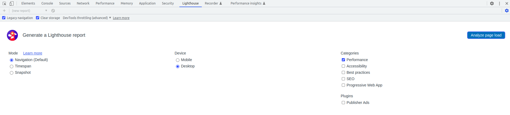

# Webvitals Testing
Just checking how web vitals work

## web vital api
The *web-vital-api* contains a NestJS application that will provide data with a delay.

## web vital fe
The page that uses the api. It is assumed that the backend is listening on port 3000.

## Running Lighthouse
You can use chrome's built in lighthouse. I changed the throttling settings to *DevTools Throttling*  



or   


If you prefer to run it with cli tool. Install it globally with npm
```
npm install -g lighthouse
```
Then run the following command with your url
```
lighthouse <url> --only-categories=performance --preset=desktop --devtools=devtools
```

## TBD
Everything...