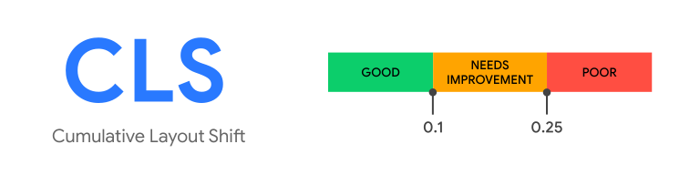

# Cumulative Layout Shift

## FAQ
### What is CLS
[What is cls](https://web.dev/cls/#what-is-cls)

### How is it calculated
CLS is calculated based on 2 parameters, namely impact fraction and distance fraction. Refer the following link for more details
[Calculating cls](https://web.dev/cls/#layout-shift-score)

## CLS Score
As of Light house version 9, CLS accounts for 15% of the overall score. A score less than 0.1 is considered good.

## Optimizing CLS
[Read this](https://web.dev/optimize-cls/)

## Demo
1. cls.html  
The image is inserted after the text thereby pushing it down resulting in a layout shift   
**Refer** console for calculated value. This is just a sample to understand how cls is calculated and works only for this particular case. For general cases use **PerformanceObserver** as shown in [here](https://web.dev/cls/#measure-cls-in-javascript)
2. cls-case1.html  
Similar to cls.html, however a placeholder is added for the image loaded with delay.
3. cls-case2.html  
Here the text is loaded after the image and hence there is no layout shift.

## Reference
* https://web.dev/cls/
* https://github.com/WICG/layout-instability