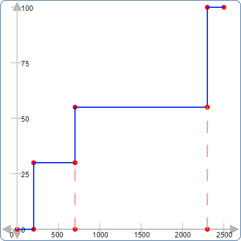
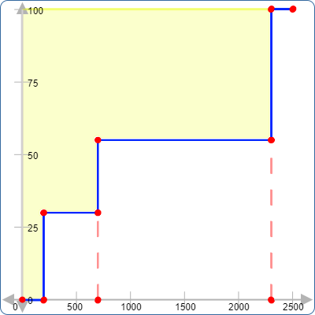

# Speed Index

### FAQ
[What SI measures](https://web.dev/speed-index/#what-speed-index-measures)

## SI Score
As of Light house version 9, SI accounts for 10% of the overall score. A score less than 3.4s is considered good and anything over 5.8s is bad.

## Demo
A rough idea to calculate speed index would be to plot the %loaded vs time

and then calculate the area above the curve

In a real site this would be much complex and the above graph suits only for our demo. Do note that this is dependant on viewport.

## Reference
* https://web.dev/speed-index/
* https://github.com/WPO-Foundation/webpagetest-docs/blob/main/src/metrics/SpeedIndex.md
* https://www.section.io/blog/speedindex-for-website-performance-monitoring/