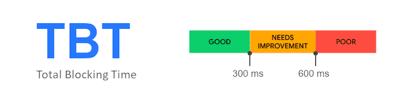
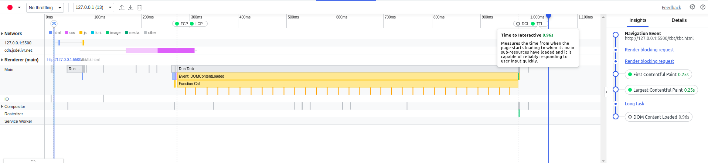
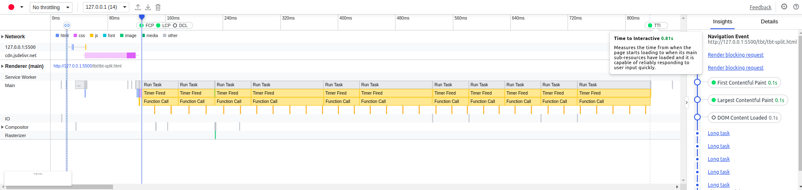

# Total Blocking Time

### What is TBT
[How is TBT calculated](https://web.dev/lighthouse-total-blocking-time/#what-tbt-measures)

## TBT Score
As of Light house version 9, TBT accounts for 30% of the overall score. A score less than 300ms is considered good.

**Note** The Lighthouse reports can be found under *lighthouse_reports* folder

## Demo
1. tbt.html 
TBT sums up the blocking time for all long tasks that occur between FCP and TTI.Any task that executes for more than 50 ms is a long task. The amount of time after 50 ms is the blocking portion. 

2. tbt-split.html 
In this demo although the TTI is same and script execution seemed to take the exact same amount of time as before, the TBT was reduced due to the fact that not all tasks were long tasks.

## Reference
* https://web.dev/lighthouse-total-blocking-time/
* https://gtmetrix.com/total-blocking-time.html