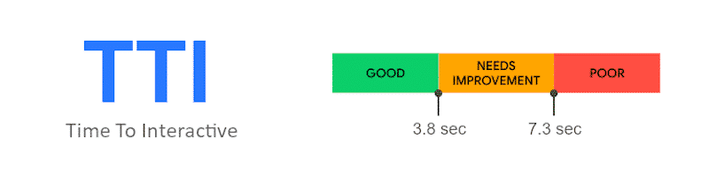
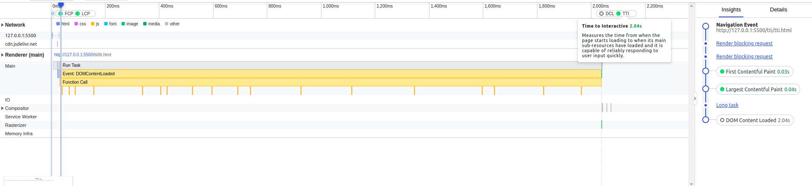
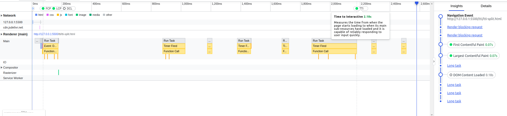

# Time to Interactive

## FAQ
### What is TTI
[What is tti](https://web.dev/interactive/?#what-tti-measures)

## CLS Score
As of Light house version 9, TTI accounts for 10% of the overall score. A score less than 3.8s is considered good.

**Note** The Lighthouse reports can be found under *lighthouse_reports* folder
## Demo
1. tti.html  
TTI is a point when the last Long Task(greater than 50ms) finishes and is followed by 5 seconds of inactivity on the main thread.

2. tti-split.html  
Note that there are tasks even after TTI but since they are smaller tasks(less than 50ms) it is not considered for TTI. 

3. tti-cheat.html  
This is not supposed to be a method to improve TTI. Just demonstrating that TTI is not affected by longer tasks after that initial gap of 5 seconds.

## Reference
* https://wp-rocket.me/lighthouse-performance-score-wordpress/improve-time-to-interactive/